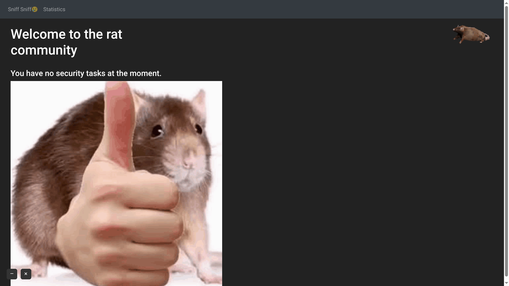

# RATS

## Comment utiliser avec Windows
Télécharger l'installateur, l'exécuter et c'est fini.

## Mise en situation
Plusieurs personnes souhaitent s’y mettre, mais le manque de motivation est souvent problématique. Plusieurs commencent, mais ne se forcent pas à réellement apprendre. C’est ce problème spécifiquement que notre solution vise à résoudre.

## Notre approche
Une solution innovatrice qui réinvente comment on voit les formations de sécurité en ajoutant un incitatif considérable pour apprendre et surtout avoir les bonnes réponses. 

De plus notre solution, étant complètement gratuite, démocratise l’accès aux connaissances et permet à tout le monde de votre enfant à votre grand-mère d’apprendre à se protéger.

Des questions pertinentes sur la sécurité à des moments aléatoires.
Fini le manque de motivation et les excuses, l’utilisateur est rappelé à tous moments de continuer son apprentissage

En cas de mauvaises réponses, un fichier aléatoire de l’utilisateur est encrypté.
Il est impossible de ne rien apprendre, si à chaque question, on ajoute la peur. Chaque réponse reste gravée dans la mémoire.

## Demo
